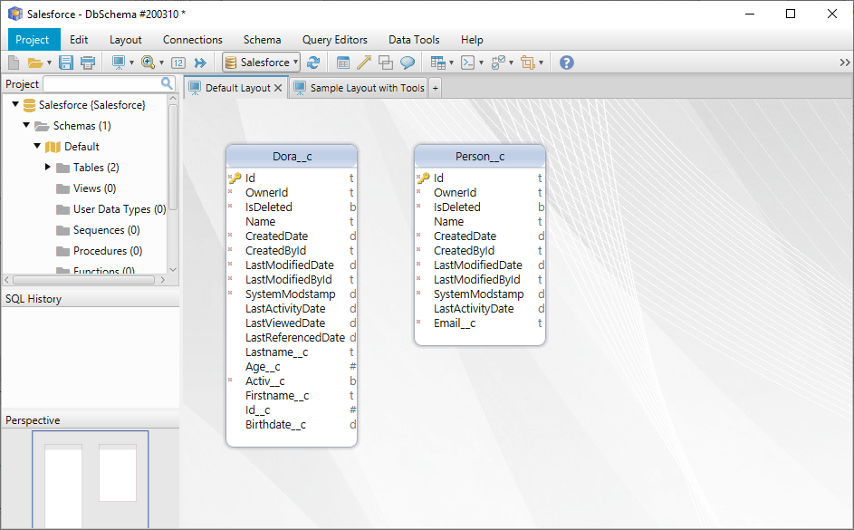
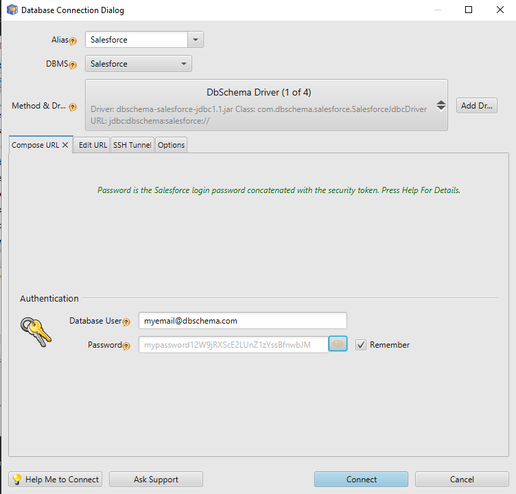
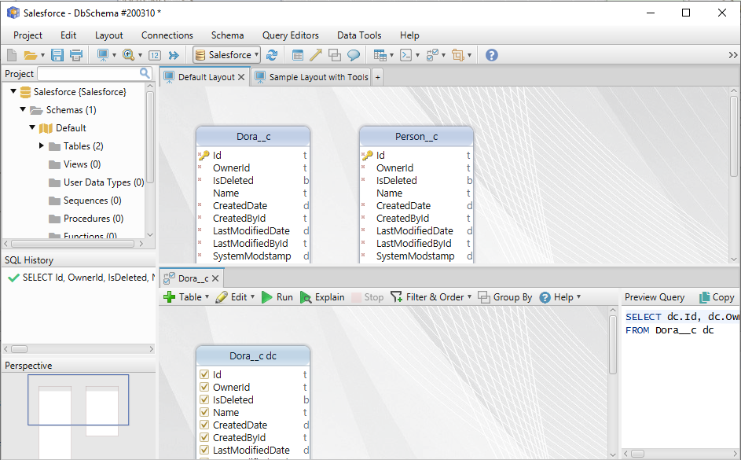
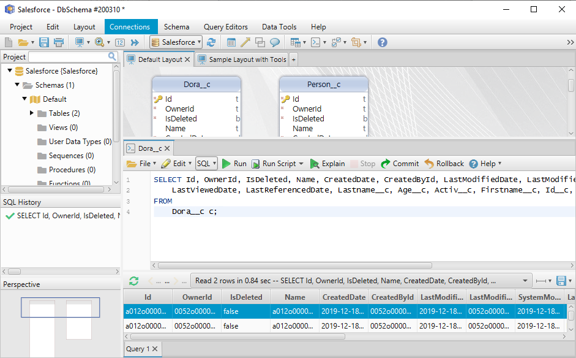

# Open Source Salesforce JDBC Driver
Full compatible JDBC driver provided by [DbSchema Database Designer](https://www.dbschema.com).

## Feature List

The driver can:
* Connect to Salesforce database
* Execute SELECT, UPDATE, DELETE statements
* Execute multiple JOIN queries: SELECT * FROM tableA JOIN tableB...
* GROUP BY queries
* UPDATE, INSERT, DELETE data

In our plans - just let us know if you need this:
* By each UPDATE, DELETE or INSERT modify back the Salesforce database
* By adding new columns or tables create them also in the Salesforce

## How the Driver Works

The driver replicates the data into an local H2 database. 
Replicated are only the tables which are involved in the executed queries. 
The table is replicated only one time, namely when is involved in a query for the first time. 

Then the client query is executed in the H2 database. 
This allows us to use all possible joins ( LEFT, OUTER ), group by, order by, selects with wildcard ( SELECT * ), etc.

## Usage 

The JDBC URL is

jdbc:dbschema:salesforce://

or 

jdbc:dbschema:salesforce://sessionid=<sessionid>

```
Connection con = DriverManager.getConnection( "jdbc:dbschema:saleforce://username=lulu@yahoo.com;password=somepasswordwithtoken" );
Statement st = con.createStatement();
ResultSet rs = st.executeQuery("select * from UserRole")
while( rs.next() ){
    ....
}
```

By default are visible only custom tables. Add tables=all to the JDBC URL to list all tables. 

We implement also two custom SQL commands: 'reload schema' will read the schema metadata again, 'clean caches' and 'cache all' are related to cached data.
Cache all will take longer but then the queries will run faster.

```
Statement st = connection.createStatement();
st.execute("reload schema");
```

We appreciate any contributions to this repository. For questions you can contact [DbSchema Technical Support](https://dbschema.com/support.html)

## Hot to Test the JDBC Driver

The driver can be tested by downloading and installing [DbSchema](https://dbschema.com). DbSchema can be evaluated 15 days for free.
There is no need to register or download the driver - DbSchema will do everything for you.



Connecting to Salesforce from DbSchema is very simple. You have to concatenate to your password also the Salesforce security token.


Login in the Salesforce web platform and go on the 'Cat Icon' on top right / Settings / Personal Information/ Reset My Security Token.
You will get the security token per email. APPEND THIS TOKEN TO THE PASSWORD (after password) and try again to login.



The JDBC URL can be edited directly in the second tab


In DbSchema you have access to different tools, like Visual Query Builder:


... or SQL Editor



or even more, like Random Data Generator, Data Loader, Virtual Foreign Keys, Forms and Reports, etc.


The driver support all native SQL queries. For now only a read-only implementation is available. We will add write capabilities 
depending on the number of requests we get.

# License

BSD License-3. Free to use, distribution forbidden. Improvements of the driver accepted only in https://bitbucket.org/dbschema/saleforce-jdbc-driver.

